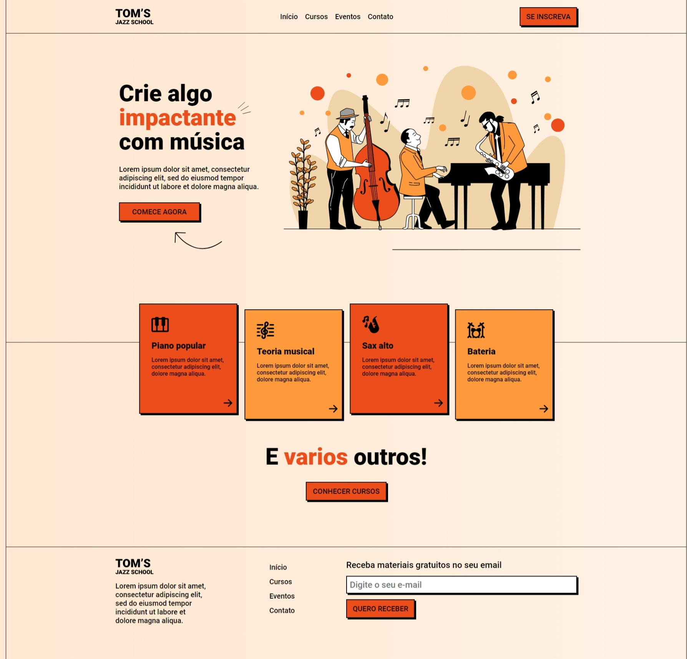
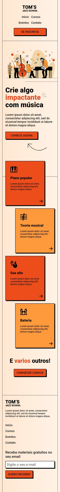

<h1 align="center" style="font-weight: bold;">Tom's Jazz School</h1>

<p align="center">
 <a href="#tech">Tecnologias</a> • 
 <a href="#about">Sobre</a> •
 <a href="#started">Começando</a> • 
  <a href="#colab">Colaboradores</a> •
 <a href="#contribute">Contribuir</a>
</p>

<p align="center">
    <b>Bem-vindo à Tom's Jazz School - sua porta de entrada para o incrível mundo da música!</b>
</p>

<p align="center">
     <a href="https://vdonoladev-landingpagemusic.netlify.app/">📱 Visite este Projeto</a>
</p>

<h2 id="layout">🎨 Layout</h2>

<p align="center">
    
    
</p>

<h2 id="technologies">💻 Tecnologias</h2>

- [HTML](https://devdocs.io/html)
- [CSS](https://devdocs.io/css)
- [Tailwind CSS](https://devdocs.io/tailwindcss)

<h2 id="about">Sobre</h2>

<p>A página inicial da Tom's Jazz School é uma página estática, projetada para mostrar a escola de jazz e fornecer informações aos alunos em potencial.</p>

<h3>Recursos</h3>

-   **Design Responsivo:** a *lading page* foi projetada para ser totalmente responsiva e otimizada para diferentes tamanhos de tela e dispositivos.
-   **IU moderna e envolvente:** a página tem uma interface de usuário moderna e visualmente atraente para atrair e envolver os visitantes.
-   **Formulário de contato:** A *página inicial* inclui um formulário de contato para os visitantes entrarem em contato com a escola de jazz.

<h2 id="started">🚀 Começando</h2>

Não existe dificuldade em rodar a aplicação! 

- **Baixe** ou **clone** a aplicação
- **Abra** o arquivo ```index.html```

<h3>Pré-requisitos</h3>

Aqui estão todos os pré-requisitos necessários para a execução da aplicação:

- Navegador Web

<h3>Clonando</h3>

Como clonar o projeto:

```bash
git clone https://github.com/vdonoladev/landingpage-music.git
```

<h3>Iniciando</h3>

Como iniciar o projeto:

```bash
cd landingpage-music
```

- **Abra** o arquivo ```index.html```

<h2 id="colab">🤝 Colaboradores</h2>

Agradecimento especial a todas as pessoas que contribuíram para este projeto.

<table>
  <tr>
    <td align="center">
      <a href="#">
        <br>
        <sub>
          <b>Víctor Donola Ferreira</b>
        </sub>
      </a>
    </td>
  </tr>
</table>

<h2 id="contribute">📫 Contribuir</h2>

1. `git clone https://github.com/vdonoladev/landingpage-music.git`
2. `git checkout -b feature/NAME-OF-FEATURE`
3. Siga os **Commit Patterns**
4. Abra um **Pull Request** explicando o problema resolvido ou o recurso feito, se houver, anexe a captura de tela das modificações visuais e aguarde a revisão!

<h3>Documentações que podem ajudar</h3>

- [📝 How to create a Pull Request](https://www.atlassian.com/br/git/tutorials/making-a-pull-request)

- [💾 Commit pattern](https://gist.github.com/joshbuchea/6f47e86d2510bce28f8e7f42ae84c716)
